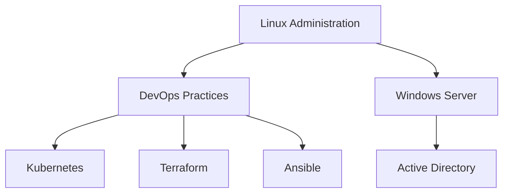
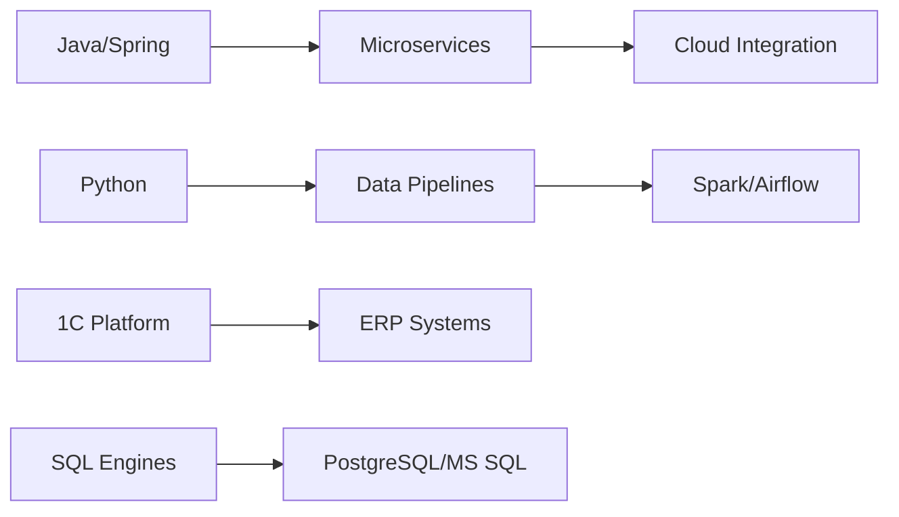

# 👨‍💻 Технический профиль: Павел Гарматюк
### Full-stack Infrastructure engineer

## 🛠️ Технологический стек (Daily Driven)

### ⚙️ Core Infrastructure

### 🧩 Development & Data

## 💼 Основные направления деятельности

### 🔄 DevOps Engineering
- Развертывание и поддержка Kubernetes-кластеров (EKS/GKE/on-prem)
- Реализация CI/CD пайплайнов (GitLab, Jenkins )
- Инфраструктура как код (Terraform)
- Мониторинг стек: Prometheus/Loki/Grafana + Alertmanager
- Контейнеризация приложений (Docker)

### 🌐 Network & Systems
- Построение отказоустойчивых сетей (Cisco/Mikrotik)
- SDN-решения (VMware NSX, Open vSwitch)
- Балансировка нагрузки (HAProxy, nginx)
- Администрирование Linux (RHEL/Debian) и Windows Server
- Виртуализация (KVM, Hyper-V)

### 🧠 Backend & Data Engineering
- Разработка Spring Boot-приложений (Java 17+)
- Создание ETL-процессов на Python (Pandas/Spark)
- Оптимизация SQL-запросов (PostgreSQL /MS SQL)
- Проектирование DWH-решений

### 🗄️ Database Administration

### 🖥️ Windows Ecosystem
- PowerShell DSC для конфигурации
- Автоматизация через Ansible WinRM
- AD CS + GPO management
- MSSQL Always On Availability Groups

## 📚 Актуальные исследования
- Оптимизация производительности PostgreSQL для OLAP-нагрузок
- Миграция legacy 1C на Kubernetes-инфраструктуру
- Реализация GitOps для корпоративных Java-приложений
- Администрирование ClickHouse для аналитических нагрузок
- Автоматизация сетевой безопасности с помощью Zero Trust Architecture

## 📫 Контактная информация
- **Telegram:** [@p_armatyk](https://t.me/p_armatyk)
- **GitHub:** [pavel-garmatyuk](https://github.com/pavel-garmatyuk)

> "Инфраструктура как код, данные как актив, автоматизация как религия"
