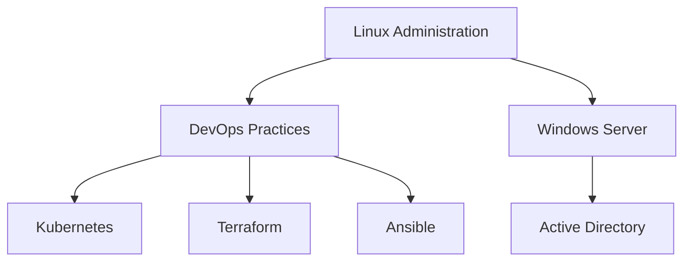
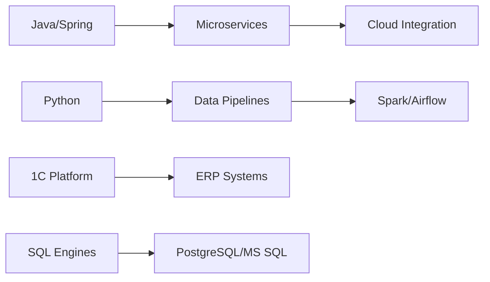

# 👨‍💻 Технический профиль: [Павел Гарматюк]
### Full-stack Infrastructure engineer

<div style="text-align: center; margin-bottom: 20px">
    
</div>

## 🛠️ Технологический стек (Daily Driven)

### ⚙️ Core Infrastructure


### 🧩 Development & Data


## 💼 Основные направления деятельности

### 🔄 DevOps Engineering
- Развертывание и поддержка Kubernetes-кластеров (EKS/GKE/on-prem)
- Реализация CI/CD пайплайнов (GitLab CI/ArgoCD)
- Инфраструктура как код (Terraform + Terragrunt)
- Мониторинг стек: Prometheus/Loki/Grafana + Alertmanager
- Контейнеризация приложений (Docker + Buildah)

### 🌐 Network & Systems
- Построение отказоустойчивых сетей (Cisco/Juniper)
- SDN-решения (VMware NSX, Open vSwitch)
- Балансировка нагрузки (HAProxy, nginx, F5)
- Администрирование Linux (RHEL/Debian) и Windows Server
- Виртуализация (KVM, Hyper-V, VMware)

### 🧠 Backend & Data Engineering
- Разработка Spring Boot-приложений (Java 17+)
- Создание ETL-процессов на Python (Pandas/Spark)
- Разработка под 1C:Предприятие (управляемые формы)
- Оптимизация SQL-запросов (PostgreSQL 15/MS SQL 2022)
- Проектирование DWH-решений

### 🗄️ Database Administration


### 🖥️ Windows Ecosystem
- PowerShell DSC для конфигурации
- Автоматизация через Ansible WinRM
- AD CS + GPO management
- MSSQL Always On Availability Groups

## 🧪 Технические практики (Hands-on)

**Infrastructure as Code (Terraform):**
```hcl
module "k8s_cluster" {
  source = "terraform-aws-modules/eks/aws"
  cluster_name = "prod-${local.env}"
  vpc_id       = module.vpc.vpc_id
  subnet_ids   = module.vpc.private_subnets
  cluster_version = "1.28"

  node_groups = {
    core = {
      desired_capacity = 3
      max_capacity     = 10
      min_capacity     = 1
      instance_types   = ["m6i.large"]
    }
  }
}
```

**Data Pipeline (Airflow + Spark):**
```python
from airflow import DAG
from airflow.operators.python import PythonOperator
from airflow.providers.apache.spark.operators.spark_submit import SparkSubmitOperator
from airflow.providers.microsoft.mssql.operators.mssql import MsSqlOperator
from datetime import datetime

def extract_api_data():
    # Реализация выгрузки данных из REST API
    pass

with DAG('retail_etl', start_date=datetime(2023, 1, 1), 
         schedule_interval='@daily', catchup=False) as dag:
    
    extract = PythonOperator(
        task_id='extract_data',
        python_callable=extract_api_data
    )
    
    transform = SparkSubmitOperator(
        task_id='transform_data',
        application="/scripts/spark_etl.py",
        conn_id="spark_cluster"
    )
    
    load = MsSqlOperator(
        task_id='load_to_dwh',
        mssql_conn_id="mssql_dwh",
        sql="EXEC dbo.LoadStagingData"
    )
    
    extract >> transform >> load
```

**Linux Administration (Bash):**
```bash
#!/bin/bash

# Мониторинг использования диска
ALERT_THRESHOLD=90
CURRENT_USAGE=$(df / | awk 'END{print $5}' | sed 's/%//')

if [ "$CURRENT_USAGE" -ge "$ALERT_THRESHOLD" ]; then
    echo "Критическое использование диска: ${CURRENT_USAGE}%" | \
    mail -s "Disk Alert on $(hostname)" admin@example.com
fi
```

## 📚 Актуальные исследования
- Оптимизация производительности PostgreSQL для OLAP-нагрузок
- Миграция legacy 1C на Kubernetes-инфраструктуру
- Реализация GitOps для корпоративных Java-приложений
- Администрирование ClickHouse для аналитических нагрузок
- Автоматизация сетевой безопасности с помощью Zero Trust Architecture

## 📫 Контактная информация
- **LinkedIn:** None 
- **Телеграм:** @p_armatyk
- **Email:** None

> "Инфраструктура как код, данные как актив, автоматизация как религия"
